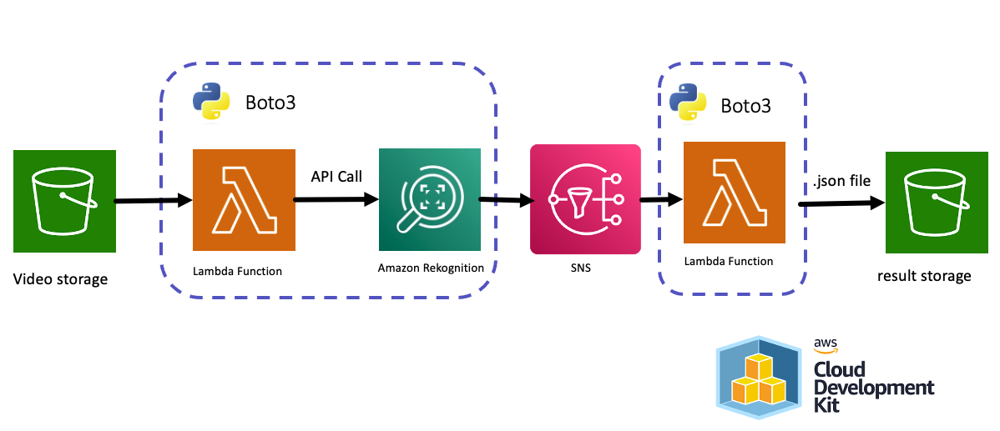
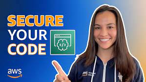
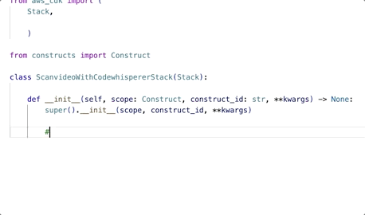
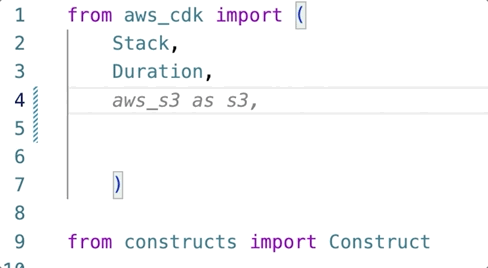
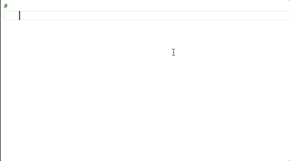

# Create a Video Content Moderation application. ⏯️ 🔫 🚬 in using [AWS CodeWhisperer](https://aws.amazon.com/es/pm/codewhisperer)

> The original content of my blog.: [All the things that Amazon Comprehend, Rekognition, Textract, Polly, Transcribe, and Others Do](https://community.aws/posts/all-the-things-that-comprehend-rekognition-textract-polly-transcribe-and-others-do)

In this repo, I will guide you step by step on how to create a video moderation application. [AWS Cloud Development Kit (AWS CDK)](https://docs.aws.amazon.com/cdk/v2/guide/home.html) using [AWS CodeWhisperer](https://aws.amazon.com/es/pm/codewhisperer). 

I am a fan of action movies and wanted to try Rekognition with the trailer of Die Hard 1, so I created this application, and wow! Each frame is pure violence 🫣... I invite you to create and test it with a trailer of your favorite movie.

 


### What is CodeWhisperer?
It is a general-purpose code generator based on machine learning that provides real-time code recommendations. As you write code, CodeWhisperer automatically generates suggestions based on existing code and comments. Its personalized recommendations can vary in size and scope, ranging from a single-line comment to complete functions.

CodeWhisperer can also scan your code to highlight and identify security issues.

## How does this application work?

1. Upload a video in .mp4 format to a specific location. [Bucket de S3](https://docs.aws.amazon.com/es_es/AmazonS3/latest/userguide/UsingBucket.html).
2. Une [Amazon Lambda Function](https://docs.aws.amazon.com/es_es/lambda/latest/dg/welcome.html) It makes the API call to [Amazon Rekognition](https://aws.amazon.com/es/rekognition/).
3. After the video review is completed, a new Lambda function retrieves the result and stores it in an Amazon S3 bucket..

## Instructions to create it with [AWS CodeWhisperer](https://aws.amazon.com/es/pm/codewhisperer): 

### Step 1: Set up [AWS CodeWhisperer](https://aws.amazon.com/es/pm/codewhisperer) en [VS Code](https://code.visualstudio.com/) For individual developers:

Following the steps in [CodeWhisperer Setup for Individual Developers](https://docs.aws.amazon.com/codewhisperer/latest/userguide/whisper-setup-indv-devs.html) o ve el siguiente video: 

[](https://www.youtube.com/watch?v=sFh3_cMUrMk&t=1s)

### Step 2: Create the Environment for [AWS Cloud Development Kit (AWS CDK)](https://docs.aws.amazon.com/cdk/v2/guide/home.html): 

Following the steps of [Your First AWS CDK Application](https://docs.aws.amazon.com/es_es/cdk/v2/guide/hello_world.html)

- Create the folder for the application and then navigate into it: 

```
mkdir scanvideo-with-codewhisperer 
cd scanvideo-with-codewhisperer 
```

- Initialize the application in the Python language:

```
cdk init app --language python
```
- Activate the virtual environment and install the core AWS CDK dependencies.

```
source .venv/bin/activate
python -m pip install -r requirements.txt
```

### Paso 3: Crear La Aplicación: 

In this step, we will ask [AWS CodeWhisperer](https://aws.amazon.com/es/pm/codewhisperer) to suggest the code that will bring our application to life.

 

Returning to the architecture, we need to create the following:

1. An Amazon S3 bucket, named video-storage.
2. Two Lambda Functions:
    - lambda_invokes_Rekognition: To invoke the start_content_moderation API of Amazon Rekognition.
    - lambda_process_Rekognition: To process the result from Amazon Rekognition.
3. An Amazon SNS Topic to generate a notification to lambda_process_Rekognition when the video processing is complete.

To start generating the code, go to /scanvideo-with-codewhisperer/scanvideo_with_codewhisperer/scanvideo_with_codewhisperer_stack.py created in the environment from the previous step.

Write the following instructions one by one. Once you write the instruction, press enter, then press option + c keys, and use the right and left arrow keys to select the most appropriate code suggestion.

In this video, you can see an example:

[](https://www.youtube.com/watch?v=qu67bvH2Y08)

> 🚨 **Attention** : Amazon CodeWhisperer provides code suggestions that may not necessarily be 100% correct. You should review it and modify it if necessary.

1 - Create the Amazon S3 Bucket:

`#cdk code to amazon s3 bucket named "video-storage"`



```python
video_storage = s3.Bucket(self, "video-storage",
                                       versioned=False,
                                       removal_policy=RemovalPolicy.DESTROY,
                                       auto_delete_objects=True)
```

2 - Create the Amazon SNS Topic:

`#cdk code to sns topic named "scan-video-topic"`
```python
scan_video_topic = sns.Topic(self, "scan-video-topic")
```

3 - Create the Amazon IAM Role to execute Amazon Rekognition:"

`#cdk code to role to grant to assume amazon rekognition`

```python
rekognition_role = iam.Role(self, "rekognition-role",
                                    assumed_by=iam.ServicePrincipal("rekognition.amazonaws.com"))
        
```

4 - Add to the previous Role the policy that allows Amazon Rekognition to publish to the SNS Topic:

`#cdk code to add a policy to the role to allow rekognition to publish sns`

```python
rekognition_role.add_to_policy(iam.PolicyStatement(
            actions=["sns:Publish"],
            resources=[scan_video_topic.topic_arn]
        ))
```

5 - Create the Amazon Lambda Function responsible for invoking Rekognition (create the folder /lambdas_code/lambda_invokes_rekognition to add the code in lambda_function.py)

`#cdk code to create a lambda function to scan the video`
```python
scan_video_lambda = lambda_.Function(self, "lambda_invokes_Rekognition",
                                              runtime=lambda_.Runtime.PYTHON_3_8,
                                              handler="lambda_function.lambda_handler",
                                              code=lambda_.Code.from_asset("./lambdas_code/lambda_invokes_rekognition"),
                                              timeout=Duration.seconds(300),description = "Invokes Amazon Rekognition",
                                              environment={
                                                  "SNS_TOPIC_ARN": scan_video_topic.topic_arn,
                                                  "VIDEO_STORAGE_BUCKET": video_storage.bucket_name,
                                                  "REKOGNITION_ROLE_ARN": rekognition_role.role_arn
                                                  }
        )
```

6 - Required permissions for lambda_invokes_rekognition Lambda Function:

`#cdk code to add a permission to the lambda function to allow it to read from the video storage`

```python
video_storage.grant_read(scan_video_lambda)
```

`#cdk code to add a lambda function role policy to invoke amazon rekognition StartContentModeration`

```python
scan_video_lambda.add_to_role_policy(iam.PolicyStatement(
            actions=["rekognition:StartContentModeration", "rekognition:GetContentModeration"],
            resources=["*"]
            ))
```

`#cdk code to amazon s3 bucket event to trigger lambda function LambdaDestination`
```python
video_storage.add_event_notification(s3.EventType.OBJECT_CREATED,
                                              aws_s3_notifications.LambdaDestination(scan_video_lambda),
                                              s3.NotificationKeyFilter(prefix="videos/"))
```

`#cdk code to add a lambda function role policy passrole action to resources rekognition`

```python
scan_video_lambda.add_to_role_policy(iam.PolicyStatement(
            actions=["iam:PassRole"],
            resources=[rekognition_role.role_arn]
            ))
``` 

`#cdk code to add a lambda function role policy passrole action to resources rekognition`

```python
        scan_video_lambda.add_to_role_policy(iam.PolicyStatement(
            actions=["iam:PassRole"],
            resources=[rekognition_role.role_arn]
            ))
```

7 - Create the Amazon Lambda Function responsible for processing the result from Amazon Rekognition (the code for this is created separately in /lambdas_code/lambda_process_rekognition)

`#cdk code to create a lambda function to process result of content moderation`

```python
process_result_lambda = lambda_.Function(self, "lambda_process_rekognition",
                                                  runtime=lambda_.Runtime.PYTHON_3_8,
                                                  handler="lambda_function.lambda_handler",
                                                  timeout=Duration.seconds(300),description = "Process Amazon Rekognition ",
                                                  code=lambda_.Code.from_asset("./lambdas_code/lambda_process_rekognition"),
                                                  environment={
                                                      "BUCKET_NAME": video_storage.bucket_name
                                                      }
                                                      )
```

8 - Required permissions for lambda_process_rekognition Lambda Function:

`#cdk code to add a permission to the lambda function to allow it write from the video storage`

```python
video_storage.grant_write(process_result_lambda)
```

`#cdk code to add a lambda function role policy to invoke amazon rekognition GetContentModeration`

```python
process_result_lambda.add_to_role_policy(iam.PolicyStatement(
            actions=["rekognition:GetContentModeration"],
            resources=["*"]
            ))
```

`#cdk code to add a LambdaSubscription`

```python
scan_video_topic.add_subscription(subs.LambdaSubscription(process_result_lambda))
```

9 - Make sure to import all the necessary libraries.



```python
from aws_cdk import (
    Stack,
    Duration,
    RemovalPolicy,
    aws_s3 as s3,
    aws_sns as sns,
    aws_iam as iam,
    aws_lambda as lambda_,
    aws_s3_notifications,
    aws_sns_subscriptions as subs,
  )
```

When you finish, you should see something like in [scanvideo_with_codewhisperer_stack.py](/scanvideo-with-codewhisperer/scanvideo_with_codewhisperer/scanvideo_with_codewhisperer_stack.py)


### Step 4: Code for the Amazon Lambda Function `lambda_invokes_rekognition`: 

You can create it with just one line of request:

`#python code a lambda function to start rekognition video content moderation`



```python
import boto3
import json
import os

def lambda_handler(event, context):
    print(event)
    # Get the object from the event and show its content type
    bucket = event['Records'][0]['s3']['bucket']['name']
    key = event['Records'][0]['s3']['object']['key']
    print(bucket)
    print(key)
    client = boto3.client('rekognition')
    response = client.start_content_moderation(
        Video={
            'S3Object': {
                'Bucket': bucket,
                'Name': key,
            }
        },
        NotificationChannel={
            'SNSTopicArn': os.environ['SNS_TOPIC_ARN'],
            'RoleArn': os.environ['REKOGNITION_ROLE_ARN']
        },
        JobTag='rekognition-video-content-moderation'
    )
    print(response)
    return {
        'statusCode': 200,
        'body': json.dumps('Hello from Lambda!')
    }
    
```

Here you can see the final code: [lambda_invokes_rekognition/lambda_function.py](/scanvideo-with-codewhisperer/lambdas_code/lambda_invokes_rekognition/lambda_function.py)

### Step 5: Code for the Amazon Lambda Function `lambda_process_rekognition`: 

This Lambda Function does more things separately, so we will request suggestions in a structured way: 

`#create a function to get content moderation from jobid from rekognition`

```python
import boto3
import json
import os

def get_content_moderation(job_id, rekognition_client):
    response = rekognition_client.get_content_moderation(JobId=job_id)
    return response
```

`#upload response to s3 bucket`

```python
def upload_to_s3(bucket, key, response,s3_client):
    s3_client.put_object(bucket, key).put(Body=json.dumps(response))
    return response
```

`#get jobid from event sns message`

```python
def get_jobid(event):
    message = json.loads(event['Records'][0]['Sns']['Message'])
    return message['JobId'] 
```

`#get object name from event sns message`
```python
def get_object_name(event):
    message = json.loads(event['Records'][0]['Sns']['Message'])
    return message['Video']['S3ObjectName']
```

`#create a lambda function to get content moderation from rekognition`

```python
def lambda_handler(event, context):
    jobid = get_jobid(event)
    object_name = get_object_name(event)
    filename = object_name.replace(".mp4", ".json")
    print(jobid)
    rekognition_client = boto3.client('rekognition')
    response = get_content_moderation(jobid, rekognition_client)
    print(response)
    upload_to_s3(bucket_name, filename, response,boto3.client('s3'))
    return response
```

>👾 Remember to add the bucket name to the code.--> `bucket_name = os.environ.get('BUCKET_NAME')`


Here you can see the final code:[lambda_process_rekognition/lambda_function.py](/scanvideo-with-codewhisperer/lambdas_code/lambda_process_rekognition/lambda_function.py)

### Step 6: Deploy and test!

Once the code is generated, in the terminal, go back to the scanvideo-with-codewhisperer folder, and deploy🚀 with: 

```
cdk deploy
```

🤖 Ready!! You've created a Video Moderation application 👨🏻⏯️ 🔫 🚬!

I'll leave you a video for you to test it quickly --> [Video](imagenes/moderation-video.mp4)

### Step 7: Delete the application.

To delete everything created earlier, just enter the following command:

```
cdk destroy
```

### 🚀 Keep learning:

- [Mastering the art of CodeWhisperer 🪄](https://www.youtube.com/watch?v=sFh3_cMUrMk&list=PLDqi6CuDzubxzL-yIqgQb9UbbceYdKhpK)
- [Get Started](https://aws.amazon.com/es/codewhisperer/resources/)
- [Dive deep with a workshop](https://catalog.us-east-1.prod.workshops.aws/workshops/a33a5d69-1417-4d5f-acc9-ae5c7fba665b/en-US)
- [Learn how to build an event-driven  serverless app](https://youtu.be/8vkHLnhIFGA?si=PQQjt4egDioq22YN)

----

# 🚨Did you like it? 👩🏻‍💻 Any feedback? 🎤 Tell me everything! --> [acá](https://www.pulse.aws/survey/LMJI72HJ)

----

## Thank You !

Te dejo mis redes: 
🇻🇪🇨🇱 [Dev.to](https://dev.to/elizabethfuentes12) [Linkedin](https://www.linkedin.com/in/lizfue/) [GitHub](https://github.com/elizabethfuentes12/) [Twitter](https://twitter.com/elizabethfue12) [Instagram](https://www.instagram.com/elifue.tech) [Youtube](https://www.youtube.com/channel/UCr0Gnc-t30m4xyrvsQpNp2Q)
[Linktr](https://linktr.ee/elizabethfuentesleone)

---

## Security

See [CONTRIBUTING](CONTRIBUTING.md#security-issue-notifications) for more information.

## License

This library is licensed under the MIT-0 License. See the LICENSE file.